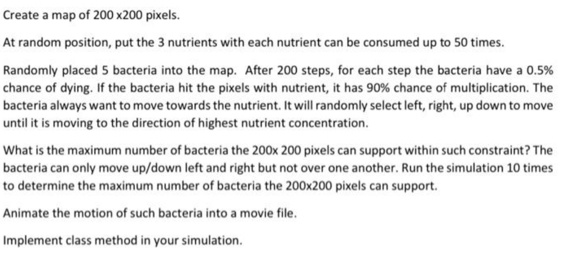
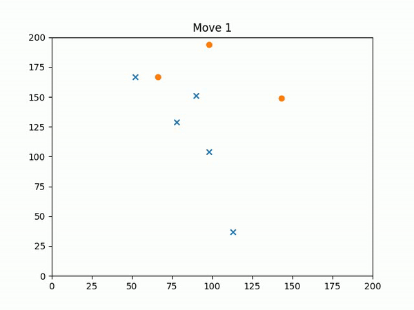

# BacteriaAndNutrient
### An ecosystem where bacteria devour nutrients

## Problem statement:

## Key components:
- generate graph with matplotlib
- produce a video from hundreds frames of graph

## Sample output:

## How to run:
1. Clone/download the project
2. Create a virtual env (or don't, totally up to you)
3. Install requirements by running `pip install -r requirements.txt`
4. run main.py. A folder named /output will be generated, where the video and image dump will be created there
